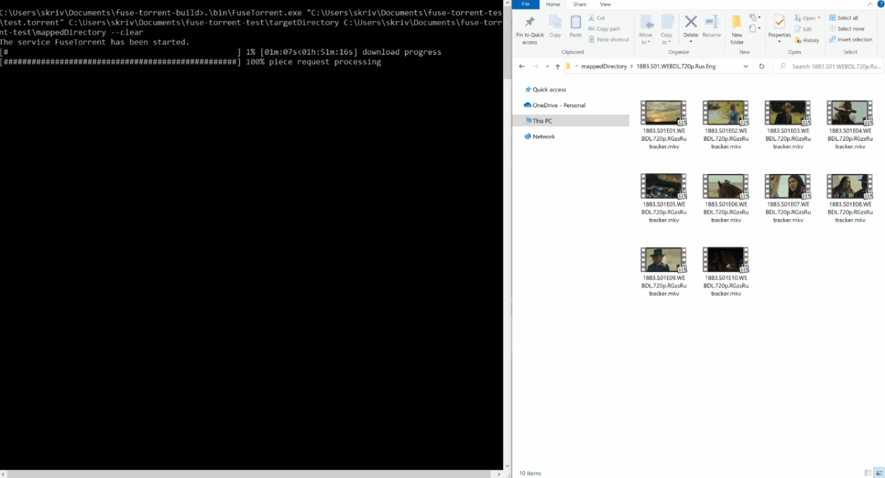

# FuseTorrent
A simple command line torrent client with FUSE file mapping

# Usage
### Interface
    A minimal torrent client that, in addition to just downloading a torrent, allows using any file from the torrent before fully downloading via a virtual file system
    Usage: FuseTorrent [OPTIONS] torrent_file target_diretory mapping_diretory

    Positionals:
      torrent_file TEXT:FILE REQUIRED
                                  '.torrent' file to download
      target_diretory TEXT REQUIRED
                                  directory where torrent files will be downloaded to
      mapping_diretory TEXT:PATH(non-existing) REQUIRED
                                  a directory where a virtual file system will be mounted

    Options:
      -h,--help                   Print this help message and exit
      --clear                     crear target directory

### requirenemts Linux
- FUSE module should be available (e.g. running from windows docker doesn't work)

### requirenemts Windows
- [WinFsp](https://winfsp.dev/rel/) should be installed (at least `core` component is required)
- `winfsp-x64.dll` (installed to `C:\Program Files (x86)\WinFsp\bin`) should be in `$PATH`
    - alternatively copy `winfsp-x64.dll` next to `FuseTorrent.exe`

# Build

Project is using **Cmake** (and **conan** that runs from cmake). See example build commands

### requirenemts
- \>= C++17 compatible compiler
    tested with
    - gcc9.4
    - Visual Studio 2019
- Cmake >= 3.16
- [conan](https://docs.conan.io/en/latest/installation.html)
- WinFsp (Windows only)
    - go to [winfsp](https://winfsp.dev/rel/) website
    - download winfsp installer
    - install `core` and `develop` winfsp components
- FUSE (Linux/OSX only)
    - `yum install fuse-devel` for Centos
    - `apt install libfuse-dev` for Ubuntu
    - e.t.c

## Example Windows build commands:
    git clone https://github.com/SergeyKrivohatskiy/fuse-torrent.git
    mkdir fuse-torrent-build-dir
    cd fuse-torrent-build-dir
    cmake -G "Visual Studio 16 2019" ../fuse-torrent/fuse-torrent -DCMAKE_BUILD_TYPE=Release
    cmake --build . --config Release
    
## Example Ubuntu build:
see [ubuntu.yml workflow](.github/workflows/ubuntu.yml)
