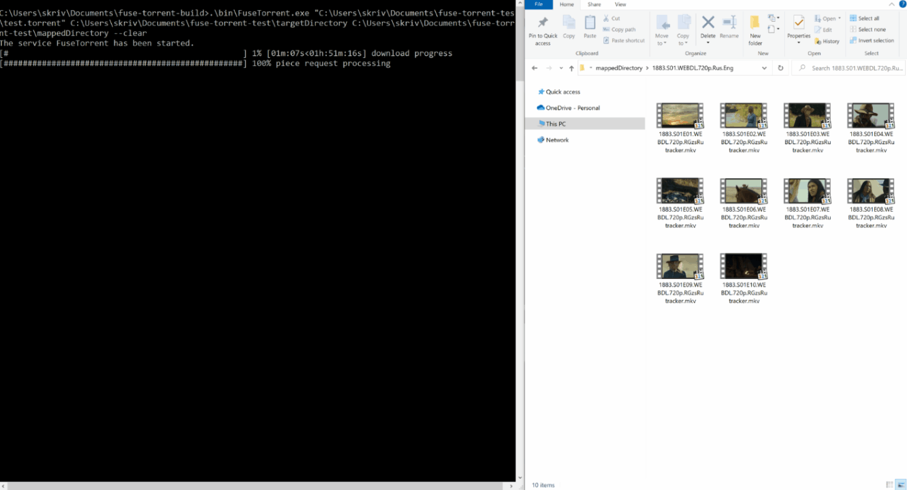

# FuseTorrent

A simple command line torrent client with FUSE file mapping

## Usage

    A minimal torrent client that, in addition to just downloading a torrent, allows
    using any file from the torrent before fully downloading via a virtual file
    system

    FuseTorrent [OPTIONS] torrent_file target_directory mapping_directory

    POSITIONALS:
      torrent_file TEXT:FILE REQUIRED
                                  '.torrent' file to download
      target_directory TEXT REQUIRED
                                  directory where torrent files will be downloaded to
      mapping_directory TEXT:PATH(non-existing) REQUIRED
                                  a directory where a virtual file system will be mounted

    OPTIONS:
      -h,     --help              Print this help message and exit
              --clear             clear the target directory before downloading

### Runtime requirements

- **Linux**: the FUSE kernel module has to be available (running inside a Windows
  Docker container, for example, does not work).
- **Windows**: [WinFsp](https://winfsp.dev/rel/) has to be installed (the `core`
  component is enough). `winfsp-x64.dll` (installed to
  `C:\Program Files (x86)\WinFsp\bin`) has to be in `$PATH`, or copied next to
  `FuseTorrent.exe`.

## Build

The project is built with CMake and takes its dependencies from
[vcpkg](https://vcpkg.io) in manifest mode, so `vcpkg.json` is the single source
of truth for what is needed. The dependency versions are pinned by
`builtin-baseline`, which makes a checkout reproduce the same dependency set.

### Build requirements

- a C++20 compiler (tested with gcc 11 and MSVC 19.3x)
- CMake >= 3.21 and Ninja
- [vcpkg](https://vcpkg.io/en/getting-started), with `VCPKG_ROOT` pointing at it
- **Linux**: `libfuse-dev` and `pkg-config`
  (`apt install libfuse-dev pkg-config` on Debian/Ubuntu)
- **Windows**: [WinFsp](https://winfsp.dev/rel/) with the `develop` component

### Build commands

    git clone https://github.com/SergeyKrivohatskiy/fuse-torrent.git
    cd fuse-torrent
    export VCPKG_ROOT=/path/to/vcpkg
    cmake --preset release
    cmake --build --preset release

The binary is written to `build/release/FuseTorrent`, and `ctest --preset
release` runs the unit tests. The first configure builds
every dependency from source and takes a while; later ones reuse the vcpkg
binary cache. A `debug` preset is available as well.

See [the CI workflow](.github/workflows/ci.yml) for a build that starts from a
bare Ubuntu machine.

## License

[MIT](LICENSE)
